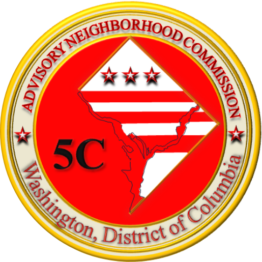

<table style="border: 0px">
<tr><td></td>
<td style="font-family: Rockwell; font-size: 25px; font-weight: bold">Government of the District of Columbia 
Advisory Neighborhood Commission 5C 
Arboretum | Brentwood | Fort Lincoln | Gateway | Langdon | Woodridge
</td></tr>
</table>

## Background/Bylaws
**Advisory Neighborhood Commission 5C is one of 46 such Commissions of the District of Columbia Government.** ANC 5C deliberates on issues facing Ward 5 neighborhoods including all/parts of Arboretum, Brentwood, Fort Lincoln, Gateway, Langdon, and Woodridge. Commissions are made up of Commissioners elected by residents of Single-Member Districts (SMDs) within each Commission Area. [Find your Single-Member District](https://dcgis.maps.arcgis.com/apps/instant/lookup/index.html?appid=12bb36e8b77a4a8780125e77e990b146).

Individual Commissioners also conduct official business on behalf of their constituents even when not on behalf of the Commission. The purpose of this website is to publish Commission materials. For non-Commission matters, please reach out to individual Commissioners.

## Meetings
**Official Commission business is conducted in publicly noticed and observed meetings.** These are governed by, in order of precedence:
- DC Code [§ 1–309.11](https://code.dccouncil.gov/us/dc/council/code/sections/1-309.11#(b)(1))
- ANC 5C's bylaws
- Roberts Rules of Order

An archive of meeting materials is below.

### Next Meeting
**A 2025 meeting schedule will be set at the January 2025 meeting,** which will be scheduled after the swearing in of the 2025-26 Commissioners.

Necessary agenda items will include:
- Officer elections for Calendar Year 2025
- Setting a meeting schedule for Calendar Year 2025

### Meeting Notice
The two official conduits for meeting notice, to meet legal obligations in the DC Code, are:
- this website
- email; for now, contact 5C@anc.dc.gov and request to be added to the email list

Individual Commissioners further notice their constituencies over their own email lists, social media, and/or paper notices. Members of the public are always invited to help push awareness to more neighbors.

### Meeting Protocol

As of October 2024, ANC 5C has moved onto the Zoom platform for meetings, as part of the DC Government's move from WebEx to Zoom. Meetings are conducted in a Webinar format, with the following permissions:
- **video access** is granted to Panelists and Hosts
- **chat to Everyone access** is available to Panelists and Hosts
- **unmute access** is granted to Attendees by Hosts if their hand is raised; if not a solicitation of comment, recognition is at the Chair or Vice Chair's discretion
- **Q&A access** is available to all Attendees, with responses furnished by Hosts as time and urgency permit

Per the requirement in DC Code [§ 1–309.11(b)(3)](https://code.dccouncil.gov/us/dc/council/code/sections/1-309.11#(b)(3)):

> Each Commission shall set aside a portion of each public meeting to hear the views of residents within the Commission area and other affected persons on problems or issues of concern within the Commission area and on proposed District government actions that affect the Commission area. Community views shall be adequately considered in positions taken by the Commission. Each Commission shall establish mechanisms to ensure the broadest dissemination of information with respect to Commission meetings, positions, and actions.

To meet this requirement, a Public Comment period is included at the end of every agenda. Some limitations that could be imposed by the Commission at a future time include:
- limiting public comment to prior sign-up
- limiting the number of commenters for any meeting
- limiting time for each commenter to comment

Webinar settings and limitations of public comment are subject to change based on prioritizing the Commission's ability to address its obligations in a manner respectful to everyone's time.

### 2024 Meeting Records

|date|type|video/transcript|minutes|notable agenda items|
|---|---|---|---|---|
|2024-11-20|regular|[Zoom](https://dc-gov.zoom.us/rec/share/CSTvhBtiBSspMMmRkbuL1IYRtA8DxAZz7jnSsAI-RDVqFX5BROjFZG1Efq1ytqpV.90t_CMG0768CMZ11)|draft approved||
|2024-10-16|regular|[Zoom](https://dc-gov.zoom.us/rec/share/0cevhGte099DMvGpbazrFlrY_V8fWLg5jremMCTwwc9r9hSAGarz6ZcaI7W20ZPv.qimFLt51ueB691_s)|draft approved||
|2024-10-09|COW|(none)|N/A||
|2024-09-18|regular|[WebEx](https://dcnet.webex.com/webappng/sites/dcnet/recording/8629e7b4583b103db6ff0612e4c4f5fe/playback)|draft approved||
|2024-06-26|regular|(voice memos)|draft approved||
|2024-05-15|regular|[WebEx](https://dcnet.webex.com/webappng/sites/dcnet/recording/055c6835f539103caf7f005056816960/playback)|draft approved||
|2024-05-08|COW|[WebEx](https://dcnet.webex.com/webappng/sites/dcnet/recording/3f0938c6efbb103cbeba00505681f03c/playback)|N/A||
|2024-04-17|regular|[WebEx](https://dcnet.webex.com/webappng/sites/dcnet/recording/2c6f06b6df38103cbfeb0050568169bd/playback)|[final](https://dcgovict-my.sharepoint.com/:b:/g/personal/5c_anc_dc_gov/EZX6-WwFOXNIsSg1Tg2PtjoBk-t0P9ltZ8dpBXxxhR4W8w?e=mh3yfe)||
|2024-04-10|COW|[WebEx](https://dcnet.webex.com/webappng/sites/dcnet/recording/05c3ba65d9b8103caf7b005056815e30/playback)|N/A||
|2024-03-20|regular|[WebEx](https://dcnet.webex.com/webappng/sites/dcnet/recording/9be4e39ac937103cacf200505681fd0f/playback)|[final](https://dcgovict-my.sharepoint.com/:b:/g/personal/5c_anc_dc_gov/EUC4iFi6d4BJu0MgYbmITz8B_eRdTgl796bBekdUO008ZQ?e=gv2ubl)||
|2024-03-13|COW|[WebEx](https://dcnet.webex.com/webappng/sites/dcnet/recording/a61c8fc6c3b7103cbdbb00505681fd0f/playback)|N/A||
|2024-02-21|regular|[WebEx](https://dcnet.webex.com/webappng/sites/dcnet/recording/15008693b33f103ca3cb005056818528/playback)|[final](https://dcgovict-my.sharepoint.com/:b:/g/personal/5c_anc_dc_gov/EWIDhAJYURNMq1xC7LwSZ7YBR5pF4Gj73yN37q_uEYq42Q?e=adnk88)||
|2024-02-02|special|[WebEx](https://dcnet.webex.com/webappng/sites/dcnet/recording/f0206c4ea41e103c9297005056814518/playback)|[final](https://dcgovict-my.sharepoint.com/:b:/g/personal/5c_anc_dc_gov/EbGqjxCmArZFvcO078jHOXkBomgLKnxo_t3zb5g1nbjGpA?e=tk9QlE)||
|2024-01-17|regular|[WebEx](https://dcnet.webex.com/webappng/sites/dcnet/recording/6693150097c2103cb4bd00505681ef57/playback)|[final](https://dcgovict-my.sharepoint.com/:b:/g/personal/5c_anc_dc_gov/EQs5oU-yn4pOqGK415zZSXgBCVRjkiFRfYQKft9CyMNI7w?e=GKxHVK)||
|2024-01-10|COW|[Teams](https://dcgovict-my.sharepoint.com/:v:/g/personal/5c07_anc_dc_gov2/EajZwXxVlNhAgdJ29fO99fsBg3IffLaGbi8WTvGJCCZn_g?e=mTTCeb)|N/A||

### 2023 Meeting Records

|date|type|video/transcript|minutes|notable agenda items|
|---|---|---|---|---|
|2023-11-15|regular|[WebEx](https://dcnet.webex.com/webappng/sites/dcnet/recording/7c3b816e6641103cbcfd122fd0056e19/playback)|[final](https://dcgovict-my.sharepoint.com/:b:/g/personal/5c_anc_dc_gov/ERdiV1XdZBFAus0oPBHUVSwBi6NTg6RsljHebgOJIp384g?e=9gelpM)||
|2023-11-09|COW|[WebEx](https://dcnet.webex.com/webappng/sites/dcnet/recording/e692723c60c0103cb3bf00505681617e/playback)|N/A||
|2023-10-18|regular|[WebEx](https://dcnet.webex.com/webappng/sites/dcnet/recording/427e4b685038103cbf53005056810026/playback)|[final](https://dcgovict-my.sharepoint.com/:b:/g/personal/5c_anc_dc_gov/EUbGGgy969hAjqz1Ru9EBPsBusjcR6Et1UN68bvsccDpNg?e=Z6Rjei)||
|2023-09-20|regular|[WebEx](https://dcnet.webex.com/webappng/sites/dcnet/recording/66a312963a37103cbd7f005056812cb9/playback)|draft approved||
|2023-09-13|COW|[WebEx](https://dcnet.webex.com/webappng/sites/dcnet/recording/6b6d294234b8103c97bc00505681ce75/playback)|N/A||
|2023-07-12|special|[WebEx](https://dcnet.webex.com/webappng/sites/dcnet/recording/a23462750331103c973f00505681c822/playback)|draft approved||
|2023-06-21|regular|[WebEx](https://dcnet.webex.com/webappng/sites/dcnet/recording/3a3041daf2b5103bbd71005056811e38/playback)|draft approved||
|2023-06-14|COW|[WebEx](https://dcnet.webex.com/webappng/sites/dcnet/recording/e798b088ed35103bb1df00505681d54e/playback)|N/A||
|2023-05-17|regular|[WebEx](https://dcnet.webex.com/webappng/sites/dcnet/recording/1eb7d07ed734103bbcf700505681f48e/playback)|draft approved||
|2023-05-10|COW|[WebEx](https://dcnet.webex.com/webappng/sites/dcnet/recording/70e375ddd1b4103baaff00505681270f/playback)|N/A||
|2023-04-19|regular|[WebEx](https://dcnet.webex.com/recordingservice/sites/dcnet/recording/b4f7e2dac134103bafaf005056810ea3/playback)|draft approved||
|2023-03-15|regular|[WebEx](https://dcnet.webex.com/webappng/sites/dcnet/recording/36096f89a5b4103b8ef700505681e7e0/playback)|draft approved||
|2023-03-08|COW|[WebEx](https://dcnet.webex.com/dcnet/ldr.php?RCID=02cbddc000000bd1bee3f0257de205f3)|N/A||
|2023-02-15|regular|[WebEx](https://dcnet.webex.com/webappng/sites/dcnet/recording/b46edfc38fba103bafe500505681bb64/playback)|draft approved||
|2023-02-06|special|(none)|final|Bylaw amendments (discussion only)|
|2023-01-18|special|[WebEx](https://dcnet.webex.com/recordingservice/sites/dcnet/recording/90afdd4779af103bbcef005056810215/playback)|final|- Officer elections - 2023 meeting schedule|

## Contact
**Email is the Government-furnished contact method for the Commission and Commissioners**; if emailing, include a brief description of the issue and the relevant locations. These emails become part of the Governmental record.

If emailing on matters of ANC 5C records/process, please include citations if referencing any Commission(er) obligations.

|district|email|Commissioner|Commissioner-elect|
|---|---|---|---|
|all 5C|5C@anc.dc.gov|designated Officers|TBD in January 2025|
|5C01|5C01@anc.dc.gov|Anthony Dale|Konyka Dunson|
|5C02|5C02@anc.dc.gov|Lauren Rogers|(waiting on election results)|
|5C03|5C03@anc.dc.gov|Tequia Hicks Delgado|Tequia Hicks Delgado|
|5C04|5C04@anc.dc.gov|Jacqueline Manning|Shawn Nelson|
|5C05|5C05@anc.dc.gov|Darlene Oliver|Darlene Oliver|
|5C06|5C06@anc.dc.gov|Harry Thomas Jr.|Harry Thomas Jr.|
|5C07|5C07@anc.dc.gov|VJ Kapur|VJ Kapur|

**Commissioners also make themselves available via phone, social media, and SMD websites.**

|Commissioner|phone|primary web/social|
|---|---|---|
|Kapur||[https://anc5c07.com](https://anc5c07.com)

For any general questions on community concerns or assistance interacting with DC agencies, please reach out to your own Commissioner and/or the Commissioner for the relevant location of the issue.